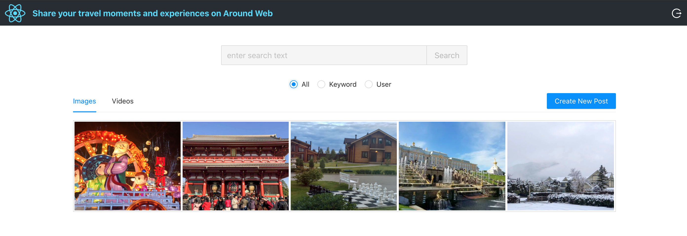
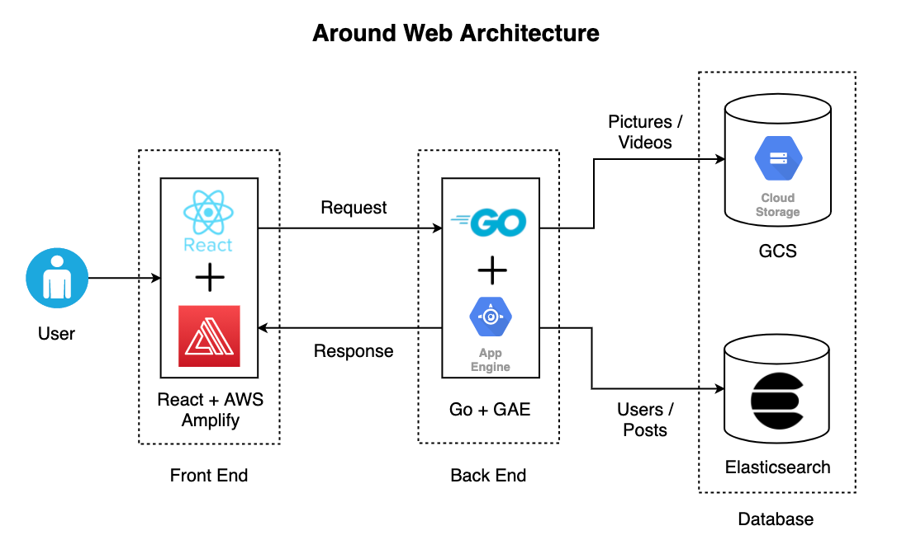

# SocialHub: A Social Networking Web App
## Description

 

Around is a fullstack web app for sharing photos, videos, and posts. It uses React for the frontend and Go for the backend, and it supports fuzzy search with Elasticsearch.
- Designed and implemented features with React for users to create, browse, and search nearby posts.
- Improved the authentication using JWT token-based registration/login/logout flow with React Router v4.
- Utilized GCS to maintain user-uploaded pictures/videos and Elasticsearch to optimize search functions such that users can search recent posts and list personal posts.
- Developed the backend services in Go and deployed to Google Cloud for better scalability and reliability.

## Architecture

 

### Frontend

Around features user-friendly webpages to create, browse, and search posts with React. Authentication is improved with token-based registration/login/logout and server-side authentication with JWT. The app is deployed on AWS Amplify.

### Backend

Around uses a scalable web service in Go for managing user posts and account information. Elasticsearch provides advanced search features for posts, and the app is deployed on Google App Engine for scalability.

### Demo

https://user-images.githubusercontent.com/92890707/189497598-2feb3a39-8cf4-4aa5-a4aa-033f962dface.mp4
